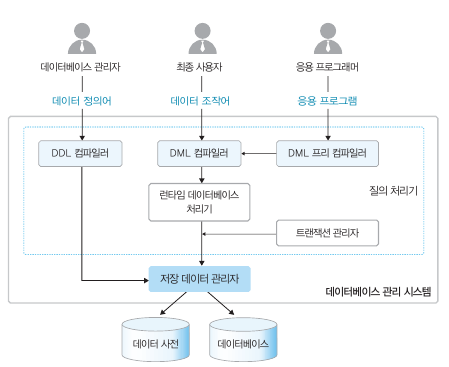

# Chapter 03. 데이터베이스 시스템
## 1. 데이터베이스 시스템의 정의
<b>구분하자!!!</b>
- 데이터베이스 : 데이터의 집합
- 데이터베이스 관리 시스템 : 데이터의 일관성 & 무결성을 만족시키기 위한 관리 역할
- 데이터베이스 시스템 : DB와 DBMS를 이용해 조직에 필요한 정보를 제공해주는 전체 시스템

## 2. 데이터베이스의 구조
- 스키마
  - 데이터의 구조와 제약조건을 정의한 것
- 3단계 데이터베이스 구조
  1. 외부 단계 : 개별 사용자 관점 -> 외부 스키마, 각 사용자별로 다름
  2. 개념 단계 : 저직 전체 관점 -> 개념 스키마, 조직 전체의 관점
  3. 내부 단계 : 물리 저장 장치 -> 내부 스키마, 데이터베이스가 실제로 저장되는 방법
- 데이터 독립성
  - 하위 스키마를 변경하더라도 상위 스키마가 영향을 받지 않는 특성(Mapping만 바꾸면 됨)
  - 각 외수 스키마, 개념 스키마, 내부 스키마별로 유기적으로 연결되어있음 <- 스키마 사이의 대응 관계를 매핑(Mapping) 이라고 한다.
  1. 논리적 데이터 독립성
     - 개념 스키마가 변경되더라도 외부 스키마가 영향을 받지 않는다.
  2. 물리적 데이터 독립성
     3. 내부 스키마가 변경되더라도 개념 스키마가 영향을 받지 않는다.
- 데이터 사전과 데이터 디렉터리
  - 데이터 사전(System Catalog) : 데이터에 관한 정보를 저장하는 곳 <- 시스템, 사용자 접근
  - 데이터 디렉터리 : 데이터 사전에 접근하기 위한 경로 <- 시스템만 접근
## 3. 데이터베이스 사용자
- 데이터베이스 관리자 : 데이터베이스 설계, 구축, 제어(데이터 정의어, 제어어)
- 최종 사용자 : 데이터 조작(삽입, 삭제, 수정, 검색)하기 위해 데이터베이스에 접근
- 응용 프로그래머 : C언어, Java 등으로 데이터베이스에 접근하는 데이터 조작어를 삽입하는 사용자
## 4. 데이터 언어
- 데이터 정의어 : 스키마 정의, 삭제, 수정, 제약조건 -> 데이터 사전에 저장
- 데이터 조작어 : 데이터의 삽입, 삭제, 수정, 검색의 처리
  - 절차적 데이터 조작어
  - 비절차적 데이터 초작어
- 데이터 제어어 : 아래 특성을 보장하기 위해서 사용
  - 무결성(integrity) : 데이터베이스에 정확하고 유효한 데이터만 유지한다.
  - 보안(security) : 허가받지 않은 사용자가 데이터에 접근하는 것을 차단하거나, 허가된 사용자가 접근 권한이 있는 데이터에만 접근할 수 있게 한다.
  - 회복(recovery) : 장애가 발생해도 데이터의 일관성을 유지한다.
  - 동시성(concurrency) : 여러 사용자가 같은 데이터에 동시에 접근하여 처리할 수 있게 한다.
## 5. 데이터베이스 관리시스템의 구성
