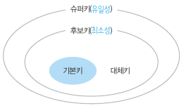

# Chapter 05. 관계 데이터 모델
## 01. 관계 데이터 모델의 개념
- 기본 용어
  - 속성(attribute) : 릴레이션의 열
  - 튜플(tuple) : 릴레이션의 행
  - 도메인(domain) : 속성 하나가 가질 수 있는 모든 값의 집합(ex => vip, gold, silver)
  - 차수(degree) : 속성의 수
  - 카디널리티(cardinality) : 튜플의 전체 개수
- 릴레이션의 구성
  - 릴레이션 스키마 : 릴레이션의 논리적 구조 (ex => 릴레이선명(속성 1, 속성 2, ...))
  - 릴레이션 인스턴스 : 투플들의 집합
  => 릴레이션 스키마가 모이면 데이터베이스 스키마, 릴레이션 인스턴스가 모이면 데이터베이스 인스턴스
- 릴레이션의 특성
  - 투플의 유일성
  - 투플의 무순서
  - 속성의 무순서
  - 속성의 원자성
- 키의 종류
   
  - 슈퍼키 : 유일성의 특성을 만족하는 속성의 집합
  - 후보키 : 슈퍼키 중에서 최소성을 만족하는 것
  - 기본키 : 후보키 중 한 개만 선택(널값x, 변경되는 값x, 단순한 값)
  - 대체키 : 기본키로 선택되지 못한 후보키
  - 외래키 : 다른 릴레이션의 기본키가 되는 것으로, 릴레이션 사이의 관계를 표현하기 위해 사용
    - 같은 릴레이션 내에서도 외래키를 사용할 수 있다.
## 02. 관계 데이터 모델의 제약
- 무결성 제약조건(integrity constraint) : 삽입, 삭제, 수정 연산으로 상태가 변하더라도 항상 지켜야 하는 중요한 규칙
  - 무결성 : 데이터에 결함이 없는 상태, 권한이 있는 사용자의 잘못된 요구에 의해 데이터가 부정확해지지 않도록 보호하는 것
- 개체 무결성 제약조건(entity integrity constraint) : 기본키는 null을 가지면 안됨
  - DBMS에서 관리하므로, DBMS에는 기본키가 무엇인지만 알려주면 된다.
- 참조 무결성 제약조건(referential integrity constraint) : 외래키는 참조할 수 없는 값을 가질 수 없다.
  - 참조되는 릴레이션의 삽입, 삭제, 수정이 이루어질 경우 하위 릴레이션의 외래키를 null로 바꾸거나, 해당 tuple을 삭제해아 한다.
