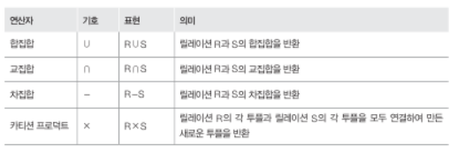
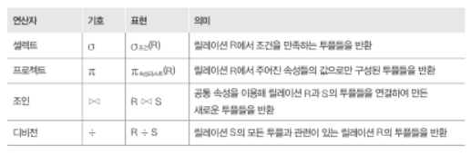
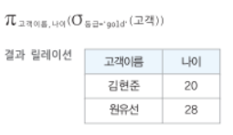
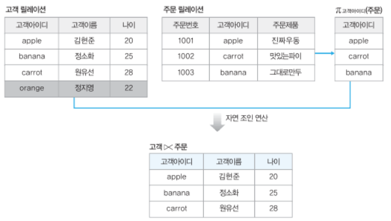
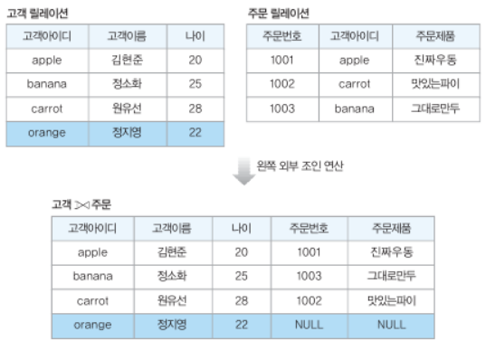

# Chapter 06. 관계 데이터 연산
## 01. 관계 데이터 연산의 개념
- 관계 데이터 연산
  - 관계 대수 : 결과를 얻기 위해 데이터의 처리 과정을 순서대로 기술(절차적)
  - 관계 해석 : 결과를 얻기 위해 데이터가 무엇인지만 기술(비절차적)
## 02. 관계 대수
- 일반 집합 연산자
  
- 순수 관계 연산자
  
- 여러 연산자를 함께 사용하기
  
- 세미 조인과 외부 조인
  - 세미 조인
    
  - 외부 조인
    